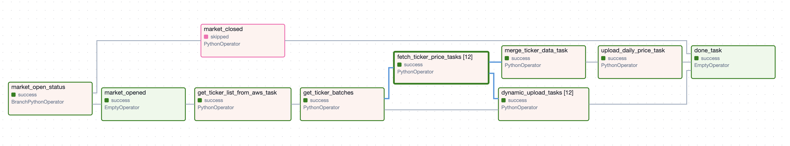
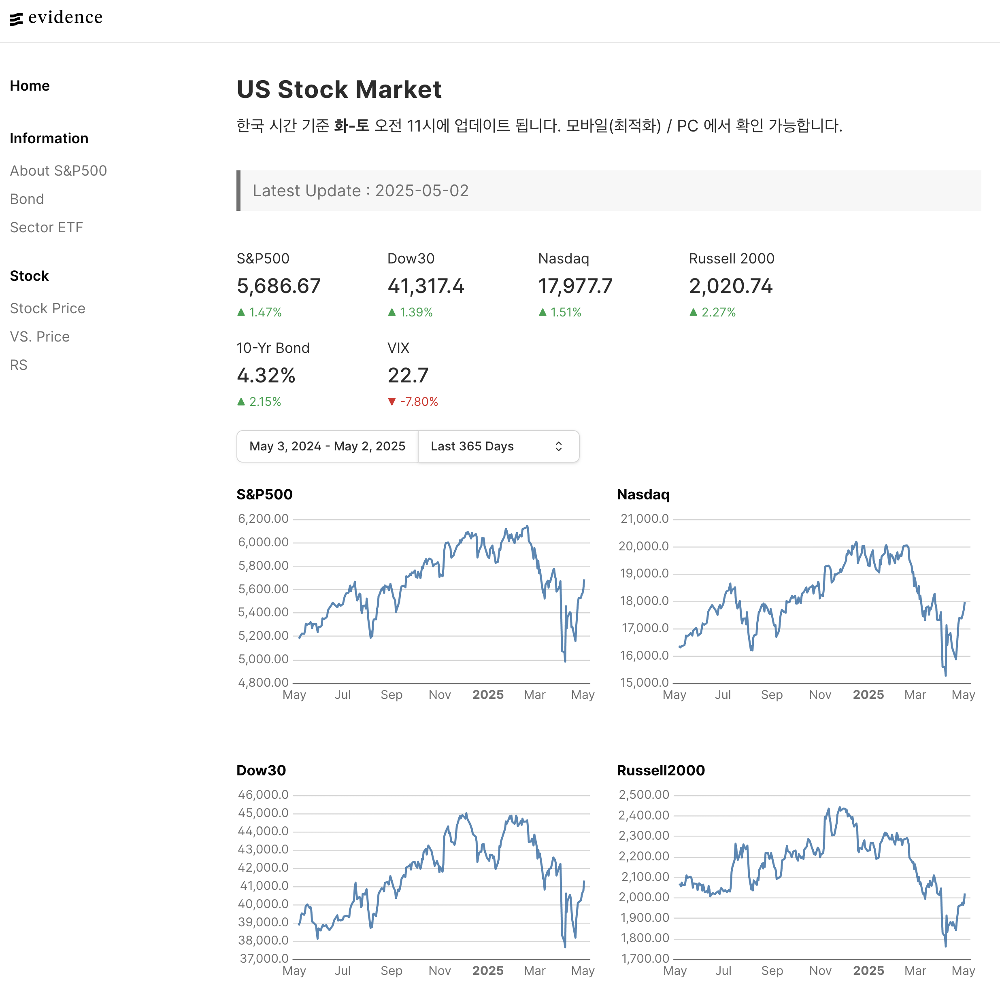
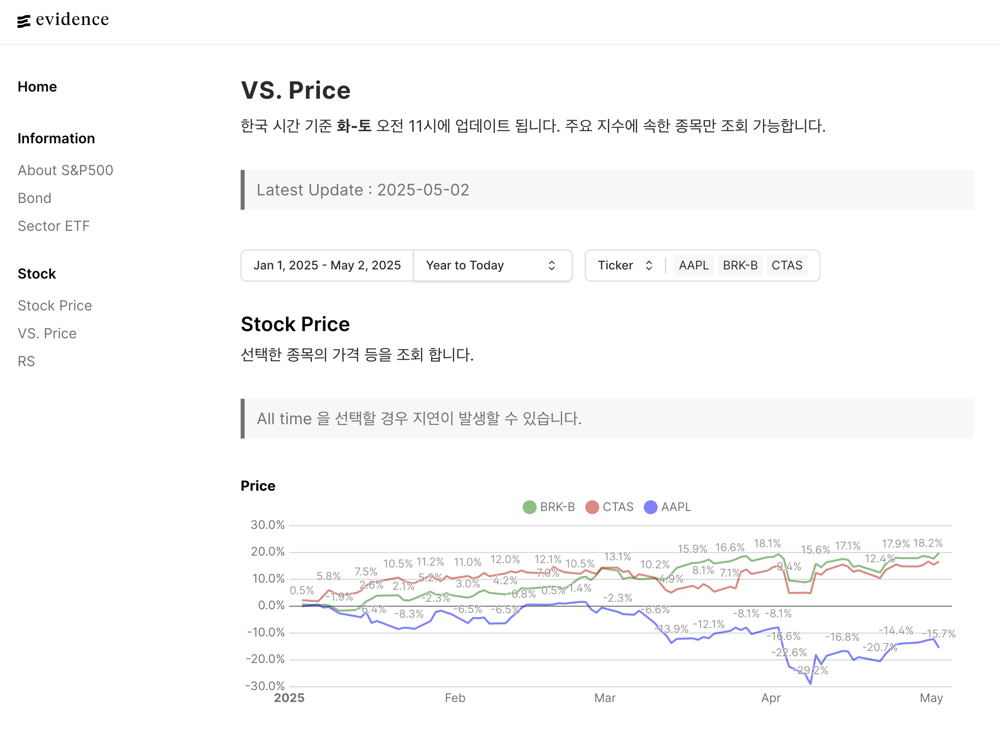
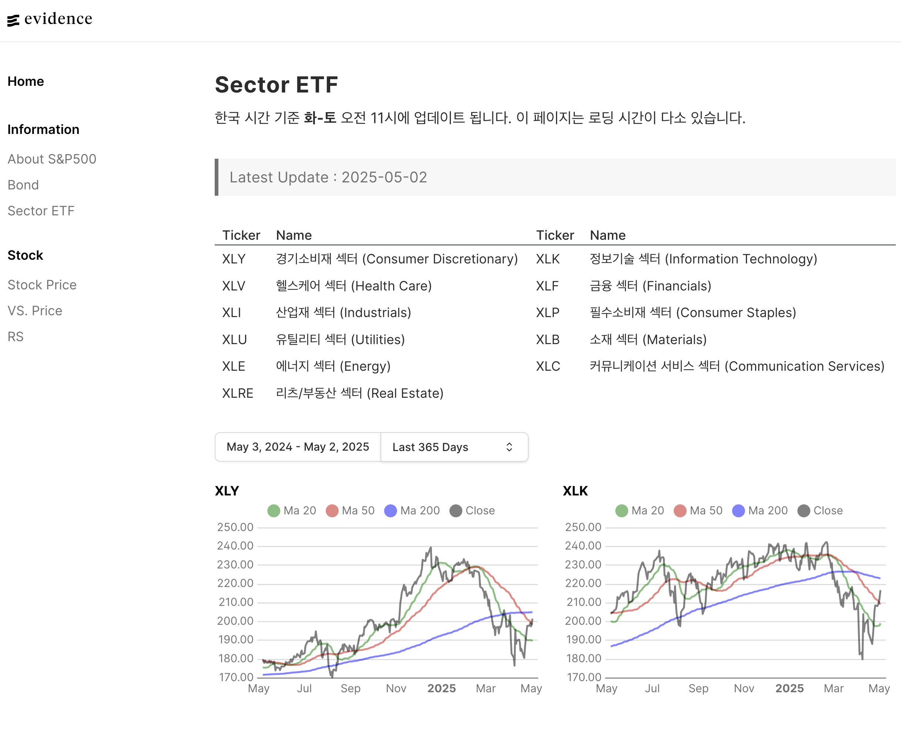
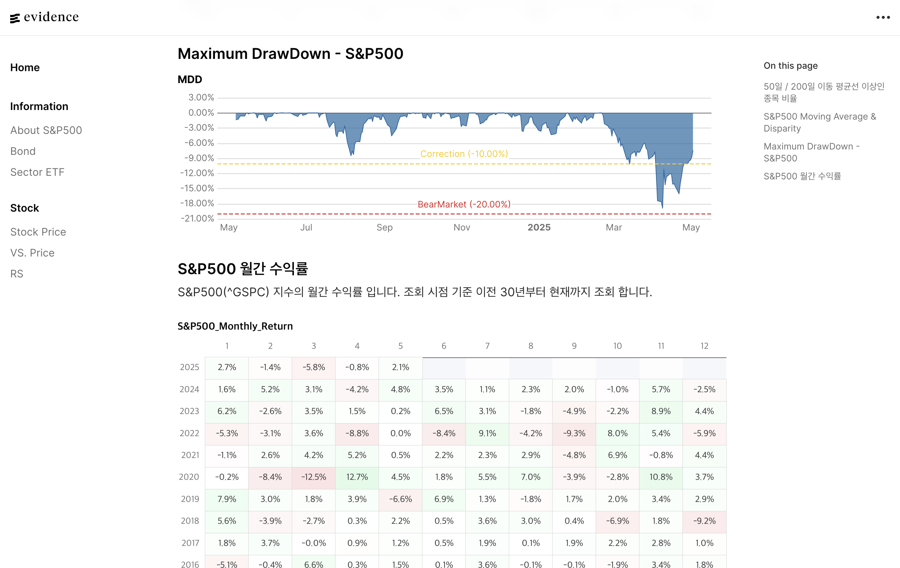

Get Stock Price Data with Airflow
===

[Yahoo Finance OpenSource](https://github.com/ranaroussi/yfinance) 를 이용하여 주가 데이터를 가져 옵니다.
> `2025-05-03` 기준, 주요 지수(S&P500, Nasdaq100, Dow30)에 속한 총 568개 종목을 가져오고 있습니다.

## 소개
Yahoo Finance OpenSource 를 이용하여 주가 데이터를 가져옵니다. Airflow 로 배치 구성을 하고 데이터는 AWS S3 에 저장합니다. 저장한 데이터는 AWS GLUE + Athena 로 조회를 하거나 [DuckDB](https://duckdb.org/) 를 이용하여 S3 데이터를 바로 조회하고 있습니다.

조회한 데이터는 [Evidence BI](https://evidence.dev/)와 [Metabase](https://www.metabase.com/) 를 이용하여 시각화 하였습니다.
- [Stock Dashboard](https://timetobye.github.io/evidence_stock_bi/)
- Github Action 을 이용하여 별도로 Evidence BI 를 배포 중 입니다.

## DAG
DAG 은 아래와 같이 구성되어 있습니다.
- stock_market_us_index_v1_dag : Index 정보 배치
- stock_market_us_mdd_v1_dag : Maximum Drawdown 계산
- stock_market_us_ticker_all_v1_dag : ticker 목록 갱신
- stock_market_us_ticker_price_v1_dag : ticker 별 가격 배치

## TODO
기본 작업 항목
- [x] airflow dags 를 비롯한 전체적인 코드 구조 변경
- [x] S3 Partition 구조 변경 - 코드 변경
- [x] config 와 market open status 분리
- [x] Slack notification 개선
- [x] 에러 처리 코드 및 retry 기능 추가(airflow 기능)
- [x] 파일 관리 시스템 개선 - 진행 중
- [x] 코드 리팩토링 - Airflow **kwargs 분리, Pipeline 간소화
- [x] S3 버킷 이름 Airflow Variable 로 관리
- [x] us market 종목 중 지수 내 속하지 않은 항목, ETF 에 대해 파일로 관리 - 일부 작업 중
- [x] 각 종목별 배당 내역 : Annual Total Return  
- [x] Quant : 상대강도지수 구현
- [x] Airflow 코드 리뷰 및 구조 변경
- [x] Athena 쿼리 수정
- [x] API 조회 후 파일 처리 방법 수정

BI 작업 항목
- [x] Metabase BI
- [x] Evidence BI

Dev 작업 항목
- [x] AWS Cloud
- [x] Devops - CI/CD with DuckDB

## Dashboard Image

| Img 1                                                   | Img 2                                                    |
|-------------------------------------------------------------------|-------------------------------------------------------------------|
|  |  |
|  |  |