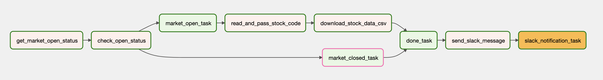
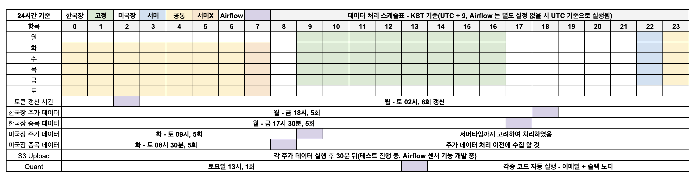

Get Stock Price Data
===

한국투자증권 트레이딩 서비스 Open API 를 이용하여 주가 데이터를 가져 옵니다.

## 1. KIS Developers

KIS Developers 는 한국투자증권 트레이딩 서비스 Open API 입니다.

[KIS Developers](https://apiportal.koreainvestment.com/intro) 에서는 국내주식주문, 국내주식시세, 해외주식주문, 해외주식현재가 등을 확인할 수 있습니다.
다른 증권사 API 와 다르게 OS를 가리지 않고 Rest API 를 이용하여 제공하기 때문에 MAC 유저도 별도의 환경을 구성하지 않고 작업을 할 수 있습니다.

또한 다른 증권사와 다르게 파이썬을 이용하여 API를 이용할 수 있으므로 C+ 등이 익숙하지 않을 경우 유용하게 사용할 수 있습니다.

KIS Developers 를 이용하기 위해서는 준비 해야 할 것이 있습니다.

## 2. 사전 준비

KIS Developers 서비스 신청을 위해서는 2가지 사전 준비물이 필요합니다. 
- (1) 한국투자증권 계좌가 개설 -> 앱을 이용하여 개설 가능
- (2) 한국투자증권 ID 등록이 필요합니다. -> 계좌 개설 후 서비스 신청을 진행

자세한 개설 과정은 [한국투자증권 - KIS Developers 서비스](https://github.com/koreainvestment/open-trading-api) 를 참고하시기 바랍니다.
- 실전투자를 하는 경우와 모의투자를 해야 하는 경우 신청하는 방식이 다르므로 참고하시기 바랍니다.
- 다른 금융 기관에서 20일 이전에 계좌 개설을 한 경우 20일이 지나야 계좌 개설이 가능합니다.
- [파이썬으로 배우는 오픈API 트레이딩 초급 예제](https://wikidocs.net/book/7559) 책을 참고해도 좋습니다.

## 3. 계좌 개설 및 ID 등록 이후

서비스 연결을 하기 위한 `보안인증키(토큰)` 와 `해쉬키` 를 발급 받아야 합니다. 발급과 관련된 내용은 https://wikidocs.net/159328 를 참고하면 됩니다.
개인정보가 담긴 항목이기 때문에 이 repo 에서는 config.ini 에 공란으로 작성되어 있습니다.

두 가지를 발급 받으면 원하는 항목을 진행할 수 있습니다. 시세를 조회하거나, 과거 데이터를 가져올 수도 있습니다. 
다만, 개인적인 이유 때문에 이 repo 에는 간단하게 과거 주가 정보를 가져오는 코드만 작성이 되어 있습니다.

기타 안내 - 토큰과 해시키에 관하여
- 2023-08-02 기준, 한국투자증권에서 제공하는 API 내 토큰과 해시키는 만료 기한이 24시간입니다.
- 그렇기 때문에 24시간이 지날 경우 갱신을 해줘야 합니다.
- 한국투자증권에 문의한 결과 토큰이 유효한지 여부에 대한 API는 제공을 하고 있지 않고 만료 기한만 확인할 수 있으므로, 마음 편하게 재발급이 낫습니다.
- 참고 문서 : F&Q - 접근토큰발급 API(/oauth2/tokenP) 재호출 관련 안내

## 4. 무엇을 할 수 있을까?

주식 데이터를 이용하여 데이터를 가져올 수 있습니다. 예를 들어 아래와 같은 과정으로 데이터를 가져오고 적재합니다.
1. API 를 이용하여 원하는 종목의 데이터를 가져오기
2. 가져온 데이터를 CSV 형태로 저장
3. Amazon S3에 업로드
4. S3 + Amazon Athena 를 이용하여 데이터 조회
5. Athena 에 Grafana 를 연결하여 Candle Stick 차트 생성
6. Crontab or Airflow 를 이용하여 데이터 적재 및 업로드 자동화

Grafana 를 이용하는 이유는 Open Source 대시보드 중에서 Candle 을 제공하는 것은 Grafana 밖에 없어서 사용하였습니다.

샘플 이미지는 아래와 같습니다.


이 외에도 여러가지를 조합하면 나만의 대시보드를 구성할 수 있습니다.


## 5. 코드 안내

기본적인 구성은 아래와 같습니다.

```
├── README.md
├── config_generate.py # 토큰과 해쉬키가 만료 되었을 때 빠르게 생성하기 위한 코드
├── configuration
│   ├── config.ini # 보안인증키와 해쉬키 정보
├── img # 샘플 이미지 
├── requirements.txt
├── stock_csv_files # 데이터가 CSV 파일로 저장 됩니다.
├── stock_daily_price.py # 장 종료 후 당일 데이터를 가져 옵니다.
├── stock_target_period_price.py # 지정된 기간의 데이터를 가져옵니다. 월간 단위로 가져올 수 있습니다.
├── upload_stock_period_data_to_s3.py # S3로 CSV 파일을 업로드 합니다.
```

데이터는 이 [문서](https://apiportal.koreainvestment.com/apiservice/apiservice-domestic-stock-quotations#L_011d4de2-a4a0-47c0-aa47-20c65a26a763) 를 
참고하여 가져왔습니다.

라이브러리는 가상환경을 구성한 후 아래 명령어를 실행해주세요.

```bash
pip install -r requirements.txt
```

### 장 종료 후 당일 데이터를 가져와야 할 경우

```bash
005930 : 삼성전자, 086520 : 에코프로, 035900 : JYP
단일 항목일 경우 : python3 stock_daily_price.py --stock_code 005930 --target_date 20230530
다중 항목일 경우 : python3 stock_daily_price.py --stock_code 005930 086520 035900 --target_date 20230530
```

### 특정 기간의 데이터를 가져와야 할 경우(당일 데이터 제외)

```bash
종목 코드 예시 > 005930 : 삼성전자, 086520 : 에코프로, 035900 : JYP
# 단일 종목에 대해서만 가져오는 경우
python3 stock_target_period_price.py --stock_code 005930 --start_year_and_month 202206 --end_year_and_month 202305
    
# 여러 종목을 한 번에 가져와야 하는 경우
python3 stock_target_period_price.py --stock_code 005930 086520 035900 --start_year_and_month 202005 --end_year_and_month 202305
```

특정 기간의 데이터를 가져 올 경우 시작 날짜는 입력 값을 기준으로 하고, 종료 날짜는 조회 당일 보다 이전이면 지정된 값으로 데이터를 받습니다.
종료 날짜가 조회 당일 보다 미래일경우 조회 당일 이전까지만 데이터를 받습니다.

### 데이터 로드

S3 를 이용할 경우에 한해서 코드를 실행하면 됩니다. Bucket 이름은 별도로 지정을 해야 합니다.


### CSV 파일 내용 예시

필드명은 API 에서 제공해주는 문서를 기반으로 사용하였습니다. 아래는 2022년 06월의 삼성전자 1개월치 데이터 입니다.

```bash
stck_bsop_date,stck_clpr,stck_oprc,stck_hgpr,stck_lwpr,acml_vol,acml_tr_pbmn,flng_cls_code,prtt_rate,mod_yn,prdy_vrss_sign,prdy_vrss,revl_issu_reas,hts_kor_isnm,stck_shrn_iscd
2022-06-30,57000,57200,57600,57000,18915142,1082799462452,00,0.00,N,5,-1000,,삼성전자,005930
2022-06-29,58000,58500,58800,58000,14677138,855770425874,00,0.00,N,5,-1400,,삼성전자,005930
2022-06-28,59400,59200,59500,58700,13540538,800041009700,00,0.00,N,2,600,,삼성전자,005930
2022-06-27,58800,59000,59900,58300,18122236,1071186745402,00,0.00,N,2,400,,삼성전자,005930
2022-06-24,58400,57900,59100,57700,23256104,1359292776100,00,0.00,N,2,1000,,삼성전자,005930
2022-06-23,57400,57700,58000,56800,28338608,1627019443340,00,0.00,N,5,-200,,삼성전자,005930
2022-06-22,57600,59000,59100,57600,23334688,1360076149300,00,0.00,N,5,-900,,삼성전자,005930
2022-06-21,58500,58700,59200,58200,25148108,1474998298400,00,0.00,N,5,-200,,삼성전자,005930
2022-06-20,58700,59800,59900,58100,34111304,1997076972175,00,0.00,N,5,-1100,,삼성전자,005930
2022-06-17,59800,59400,59900,59400,29053450,1732449618748,00,0.00,N,5,-1100,,삼성전자,005930
2022-06-16,60900,61300,61800,60500,23394896,1431052309321,00,0.00,N,2,200,,삼성전자,005930
2022-06-15,60700,61300,61500,60200,26811224,1630190882434,00,0.00,N,5,-1200,,삼성전자,005930
2022-06-14,61900,61200,62200,61100,24606420,1519195265000,00,0.00,N,5,-200,,삼성전자,005930
2022-06-13,62100,62400,62800,62100,22157816,1380636801900,00,0.00,N,5,-1700,,삼성전자,005930
2022-06-10,63800,64000,64400,63800,22193552,1419245099700,00,0.00,N,5,-1400,,삼성전자,005930
2022-06-09,65200,65100,65200,64500,25790724,1673763680952,00,0.00,N,5,-100,,삼성전자,005930
2022-06-08,65300,65400,65700,65300,12483180,817379109300,00,0.00,N,5,-200,,삼성전자,005930
2022-06-07,65500,66200,66400,65400,19355756,1273444989300,00,0.00,N,5,-1300,,삼성전자,005930
2022-06-03,66800,67200,67300,66800,8222883,550654655700,00,0.00,N,2,100,,삼성전자,005930
2022-06-02,66700,66600,67000,66400,14959443,996681075588,00,0.00,N,5,-700,,삼성전자,005930
```

## 6. Update

### [2023-08-02] 해외주식 티커 자료
해외주식(미국)을 확인할 때 필요한 ticker(티커, 종목코드) 목록을 받을 수 있습니다.

#### stock_ticker_all.py

이 코드는 상장한 모든 종목 티커를 확인할 수 있는 코드 입니다.
- 코드 상에서는 미국 상장 종목만 확인할 수 있도록 설정하였습니다. 다른 국가 정보가 필요할 경우 코드 수정을 하면 됩니다.
- 한국투자증권에서 제공하는 [샘플 코드](https://github.com/koreainvestment/open-trading-api/blob/main/stocks_info/overseas_stock_code.py)는 OS에 의존성이 있는 코드이고, 인코딩 이슈가 있어서 일부 수정하였습니다.

```Python
# 나스닥, 뉴욕, 아멕스 : 'nas', 'nys', 'ams'
# 상해, 상해지수, 심천, 심천지수, 도쿄, 홍콩, 하노이, 호치민 : 'shs', 'shi', 'szs', 'szi', 'tse', 'hks', 'hnx', 'hsx'


stock_exchange_name_list = ['nas', 'nys', 'ams'] # 순서 대로 나스닥, 뉴욕, 아멕스
```


#### stock_ticker_with_exchange.py
이 코드는 상장한 종목 중 다우30, 나스닥100, S&P500 에 해당하는 티커를 확인할 수 있는 코드 입니다.
- 한국투자증권에서 제공하는 [샘플 코드](https://github.com/koreainvestment/open-trading-api/blob/main/stocks_info/overseas_index_code.py)는 OS에 의존성이 있는 코드이고, 인코딩 이슈가 있어서 일부 수정하였습니다.
- 미국시장만 확인하기 위해서는 `국가구분코드` 항목을 `501` 로 지정해야 합니다. `501` 이외의 값 선택 시 중국 등의 시장도 확인은 가능합니다.
- 다우, 나스닥, S&P 에 해당하는 종목을 선택하기 위해서는 엑셀에서 필터로 확인하거나(필터값 1일 경우 해당 항목 선택), 별도의 전처리 과정을 수행해야 합니다. 코드 상에는 작성하지 않았습니다.
- 종목 정보 뿐만 아니라 지수 티커도(EX - 필라델피아 반도체 지수 등) 있으므로 참고하시기 바랍니다.


### [2023-08-15] 해외주식 종목 정보
이 코드는 해외주식 주가 정보를 가져옵니다.
- **stock_daily_price_us_market.py**
- 다우30, 나스닥 100, S&P500에 속한 종목을 비롯해, 모든 기업의 주가 정보를 가져오는 코드 입니다.
- 한국 주가 조회와는 다르게 `거래소`, `티커`, `조회 날짜` 를 입력해야 합니다.
- parameter
  - default : daily, 하루치 데이터만 가져오게 설정한 상태
  - 만일 최대 100 영업일 데이터가 필요하다면 `period` 부분을 `multiple` 로 변경
  - 한국투자증권 개발팀에 따르면 `multiple` 의 경우 기간 조절이 불가능합니다. 무조건 최대 100개 이하로 떨어지는 구조
- 각 데이터 필드에 대한 정보는 API 문서를 참고해주세요.
- 참고 문서 : [API 문서 - 해외주식 기간별시세[v1_해외주식-010]](https://apiportal.koreainvestment.com/apiservice/apiservice-domestic-stock-current#L_0e9fb2ba-bbac-4735-925a-a35e08c9a790)

```bash
-- Sample
 xymd      clos sign    diff   rate      open      high       low      tvol        tamt      pbid  vbid      pask vask stock_ticker
0 2023-08-14  179.4600    2  1.6700  +0.94  177.9700  179.6900  177.3050  43675627  7822228931  179.9000  2100  179.9400  200         AAPL
```

### [2023-08-20] Airflow Dag Sample Code
Airflow 를 이용해 주기적으로 데이터를 가져옵니다.

설치 및 환경 설정
- Airflow 는 Docker compose 를 이용하여 설치 하였습니다. 
- Volume mount 를 하는 것이 이로움. 추가로 data 를 별도 관리하는 디렉터리도 생성하였음
- Airflow 공식 문서 : https://airflow.apache.org/docs/apache-airflow/stable/howto/docker-compose/index.html

#### airflow_config_generate.py
이 코드는 매일 일정 주기로 토큰을 발행하는 샘플 코드 입니다.
- 한국투자증권에서 제공하는 토큰은 1일 이내의 만료 기간이 있으므로, 재갱신을 해야 합니다.
- 주말은 건너 뜁니다.
- 마켓이 영업일이면 발급을 하고, 영업일이 아닐 경우 건너 뜁니다.
- 영업일인지 여부를 먼저 확인할 수 있으면 좋겠으나, 한투에서 관련 API는 토큰 발급 후 확인할 수 있도록 만들어둔 상태라 현재는 토큰 갱신 프로세스로 처리
- 토큰 발급은 KST 기준 오전 2시 입니다. Airflow 는 별도 설정을 하지 않는 이상 UTC 기준으로 실행되므로 참고하시기 바랍니다.
- 토큰이 정상 발급 될 경우 카카오톡 계정으로 발급 메시지가 전송됨


#### airflow_stock_daily_price_ks_market.py
이 코드는 월-금에 한국 주식 시장의 정보를 가져오는 샘플 코드 입니다.
- `airflow_config_generate.py` 에 의존성을 가지고 있습니다.
- 모든 종목을 다 가져오기 위해 파일을 읽는 부분은 코드 상에 작성하지 않았습니다.
- 샘플 코드에서는 `삼성전자`, `에코프로`, `JYP Ent`(트와이스 짱...) 데이터를 받을 수 있습니다.
- 테스트 중인 부분이 있어서 코드 상에 오류가 있을 수 있습니다.
- KST 기준으로 오후 6시에 처리 됩니다.



코드 상의 문제점
- 종목의 개수가 많아졌을 때 `download_stock_data_csv` task 에서 오류가 발생할 경우에 대한 처리가 미흡함
- 종목 별로 task 를 만들기에는 종목의 개수가 많아질 경우 적절하지 않을 것으로 생각함

#### 기타
- Airflow 의 `TaskGroup` 과 `SubDagOperator` 를 이용하면 Dag 끼리도 묶을 수 있으나 이 리포에는 작성하지 않았습니다.
- Airflow schedule 에 따라 DAG 의 실행을 제어할 수도 있으나, Airflow sensor 기능에 대한 고민도 필요함 
- 대체로 아래와 같이 구성을 하면 되는데, sensor 가 있으면 시간에 구애받지 않을 수 있을 것으로 생각



#### TODO
1. Airflow 를 이용하여 미국주식 모든 종목 정보/주가 가져오기
2. Airflow 를 이용하여 처리 결과 이메일 전송 또는 슬랙 등 노티 기능
3. Qunat 용 처리 코드 외 여러가지
